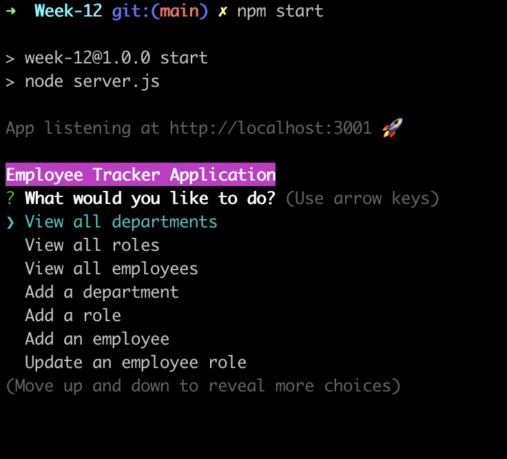

<!-- Business Management Application README -->
# Business Management Command-line Application
## Table of Contents
1. [Prerequisites](#prerequisites)
2. [Languages Used](#languages-used)
3. [The Task](#the-task)
4. [How to Install](#how-to-install)
5. [Developer Notes](#developer-notes)
6. [Screenshots](#screenshots)
7. [Links](#links)
8. [Acknowledgements](#acknowledgements)

---

## Prerequisites

Before you begin, ensure you have met the following requirements:

- You have a Windows, macOS, or Linux machine.
- You have installed the latest version of Git, NodeJS, and your preferred database.
- SSH key should be connected to Github.

---

## Languages Used

- JavaScript
- SQL (if applicable)

---

## The Task

Organize and manage company departments, roles, and employees using this command-line application.

### **Acceptance Criteria...**

|**I Want...**                                                       |**So that...**                                                       |
|--------------------------------------------------------------------|----------------------------------------------------------------------|
|to view and manage the departments, roles, and employees            | I can organize and plan my business                                  |

|**When...**                                                         |**Then...**                                                           |
|----------------------------------------------------------------------|----------------------------------------------------------------------|
|I start the application                                              | I am presented with the following options: view all departments, view all roles, view all employees, add a department, add a role, add an employee, and update an employee role |
|I choose to view all departments                                     | I am presented with a formatted table showing department names and department ids |
|...                                                                  | ... (and so on for other criteria)                                   |

<small>Note: If you don't have enough applications or features to showcase at this point, use placeholder content. Update them as your project progresses.</small>

---

## How to Install

- [Git](https://github.com/git-guides/install-git): Tool for managing and tracking changes in any set of files.
- [SSH Key](https://docs.github.com/en/authentication/connecting-to-github-with-ssh/adding-a-new-ssh-key-to-your-github-account): Secure method to connect to remote repositories.
- [Github Account](https://docs.github.com/en/get-started/onboarding/getting-started-with-your-github-account): Create and manage repositories online.
- [NodeJS](https://nodejs.org/en/download/): JavaScript runtime required to run the application.
- [Your preferred database](#): Install and setup instructions for your database.

---

## Developer Notes

Working on this project enlightened me about the intricacies of database management and the importance of a smooth user experience in a command-line interface.

---

## Screenshots

---

## Links
- [Github Repo](https://github.com/YourUsername/RepoName)
- [Additional Link or Documentation](#)

---

## Acknowledgements

- Shoutout to my mentor for the invaluable feedback and guidance.
- Special thanks to my peers who helped troubleshoot some of the trickier aspects.

---

Links for packages Used.

https://github.com/chalk/chalk

